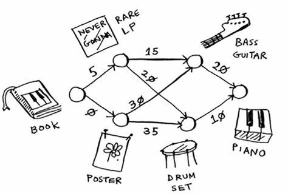

## Dijkstra graph algorithm
Dijkstra algorithm is used to find the shortest path in with the lowest cost in a *Graph*. All the costs must be positive in order for the algorithm to work correctly.

### Rust implementation
This is the exact implementation of Chapter 7, Dijkstra's algorithm in **Grokking Algorithms** book. The following graph is hardcoded into the *main* function. Refer to the Rust lib documentation on how to customize and new the **Graph** struct. I've implemented `Node`, `Edge`, and `Graph` structs to be used in the demo.
 
#### Example
If you have compiled the Rust code, then you can type in the following in the `./target` directory whether in `debug` or `release` according to your compilation.
```bash
dijkstra
```
Or you can use `cargo` directly as follows in the project's root:
```bash
cargo run
```
The output in both cases is:
```bash
[Node { name: "book" }, Node { name: "LP" }, Node { name: "Drums" }, Node { name: "Piano" }]
```
#### Docs
You can use `cargo` to run the tests and compile the docs as follows:
```bash
cargo doc
```