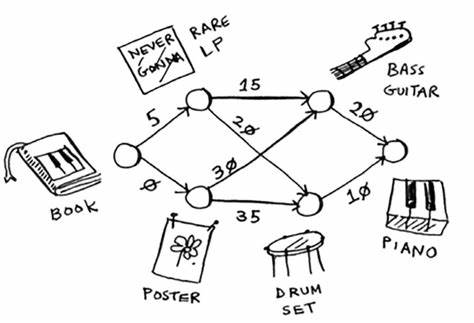

## Grokking Algorithms, Dijkstra graph algorithm
This is the exact implementation of Chapter 7, Dijkstra's algorithm in **Grokking Algorithms** book. The following graph is hardcoded into the *main* function. Refer to the Rust lib documentation on how to customize and new the **Graph** struct.
 